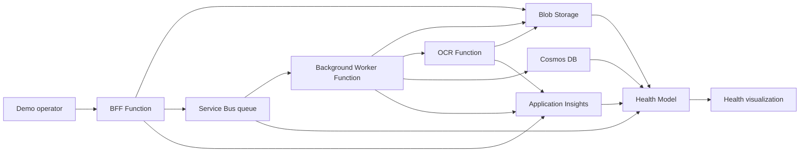

# Azure Monitor Health Models — Demo Environment Design

ExpenseFlow is a small receipt and expense processing workload used to demonstrate health-model behavior. It accepts synthetic expense submissions, queues them for background processing, calls a simulated OCR service, stores the resulting expense record, and emits real platform telemetry so dependency health and backlog signals can propagate through the model.

## Application Flow

## Tooling
- **Bicep** defines both the infrastructure and the health model.
- Single, repeatable deployment; no manual portal steps.

## Observability
- Application Insights is enabled for all Functions and backed by a central Log Analytics workspace.
- Telemetry ingestion/query access uses Azure Monitor Private Link and private DNS; public ingestion/query paths are disabled where supported.

## Security & Compliance Baseline
All resources must comply with a restricted enterprise environment:
- **No public/open endpoints** — private access only.
- **No key-based authentication** — use Managed Identity / Entra ID (RBAC).
- **Demo exception:** the worker → OCR Function internal call starts with a Function key stored in Key Vault and exposed to the worker through a Key Vault reference while the endpoint remains private-only; revisit Entra-based auth if the demo needs stricter parity with managed-environment rules.
- **VNET-integrated** with **NSGs** governing traffic.
- Private endpoints for PaaS services where applicable.
- Least-privilege RBAC throughout.

## Resource Categories
1. **Static (locked-down) resources** — fully locked down, do nothing but appear in the health model as monitored entities.
2. **Live resources** — actively used to demonstrate health concepts (e.g. emitting signals, processing queue messages, changing health state).

## Health Model
- Authored in Bicep over the provisioned resources.
- Composed of monitored entities and their relationships, producing aggregated health states for the demo.

### Auto-discovery (regional policy configuration)
Alongside the hand-authored entities, the health model includes an **Azure Resource Graph discovery rule** (`regional-policy-config`) that demonstrates dynamic, scoped auto-discovery without touching the manually authored model.

- **What is discovered:** a fleet of **Azure App Configuration** stores, each representing a region's ExpenseFlow expense policy (approval thresholds, per-diem limits, VAT handling, allowed currencies). The Functions would load the caller's regional store at runtime to decide how to process an expense.
- **Scope:** the rule's ARG query matches only stores tagged `component=policy-config`, so it never overlaps with the hand-authored entities. Discovered entities attach to a discovery-generated node, keeping the manual model pristine.
- **Signals:** recommended signals and an Azure Resource Health availability signal are added automatically to every discovered store.
- **Dynamic behavior:** discovery runs every ~5 minutes, so adding or removing a tagged store is reflected automatically. Each store is deployed to its own Azure region (Free tier, one per region) to match the regional narrative.
- **Live demo lever:** setting `enableDemoPolicyConfigRegion = true` provisions an extra regional store that the model auto-discovers within a few minutes, showing discovery reacting to a growing environment.

## Scenario — ExpenseFlow
A receipt/expense processing app that exercises the full architecture and gives an intuitive, linear flow to narrate health propagation.

**Flow:** submit expense → queue → background processing → OCR microservice → store results.

**Components:**
- **BFF Function** — serves the control panel/web UI: submit expenses, list status.
- **Background Function** — consumes receipts from the queue, orchestrates processing, writes results.
- **OCR Microservice Function** — dedicated extraction service: reads a receipt image, returns structured data.
- **Service Bus** — receipts submitted via the BFF are queued for the background processor.
- **Azure Storage** — blob storage for receipt images and a private Storage Queue reserved for future demo signals/events.
- **Database** — expense records and approval state.

**Health story:** when the OCR microservice degrades, the background processor's backlog grows and queue depth rises, propagating unhealthy state up the model. Storage throttling and a stalled background worker are similarly visible.

**Demo levers (control panel):** flood the queue, take down the OCR microservice, throttle storage, and force health-state changes to show propagation.

## Simulation Model
Keep the plumbing real, simulate the work. All Functions, Service Bus, Storage, and the database are real and genuinely exercise each other so the health model sees true signals — but receipt/OCR work is faked. No files are uploaded and no real OCR runs.

- **Synthetic submissions** — the BFF generates a fake expense (random vendor, amount, category) and writes a small JSON "receipt" blob to Storage (trivial, so done for real), then enqueues a message.
- **Keep-alive timer** — a timer-triggered function in the BFF app periodically creates synthetic submissions so the queue, worker, OCR service, storage, database, and telemetry keep producing signals even when no one is using the control panel.
- **Simulated OCR** — the microservice waits a configurable delay and returns canned/random structured data; no image processing.
- **Simulated processing** — the background Function dequeues, waits a configurable interval, calls the OCR service, and writes the expense record to the database. Real I/O, no real compute.
- **Config-driven behavior** — per-component latency, failure rate, and health state come from app settings / control-panel signals, so the flow is fully steerable without real data.

This produces genuine queue depth, storage operations, and failures for the health model while keeping each component simple to implement.

## Control Panel UI
A simple UI to drive the demo:
- Invoke health-state changes.
- Send messages into queues.
- Trigger other signals consumed by the live resources.

Must honor the same security baseline (no open endpoints, identity-based auth).

## Approach
Start from this baseline and layer in specifics incrementally (concrete resource list, health model structure, control panel design) in later iterations.
